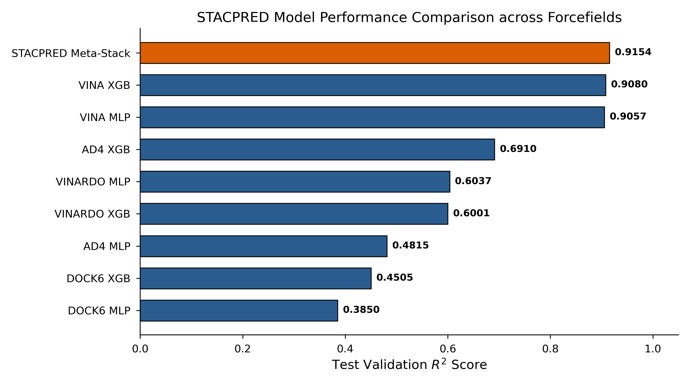
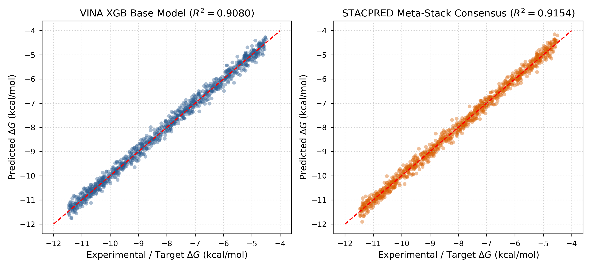
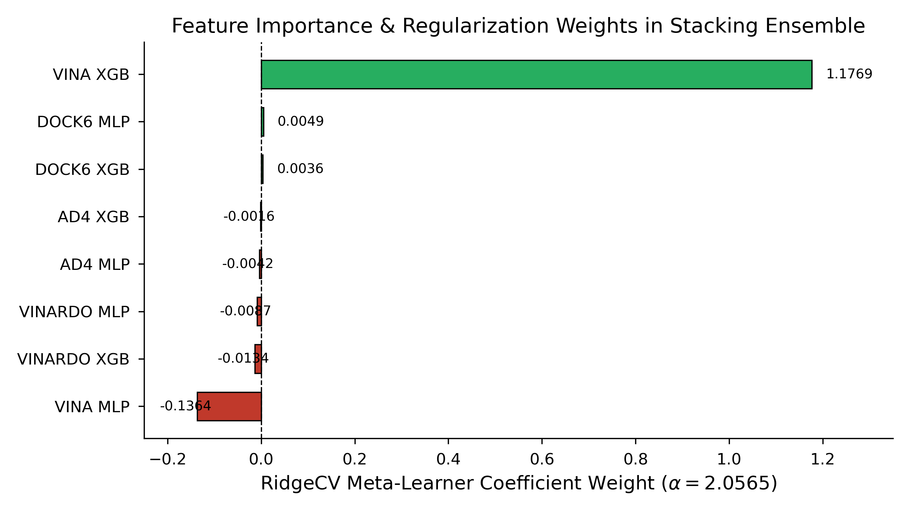
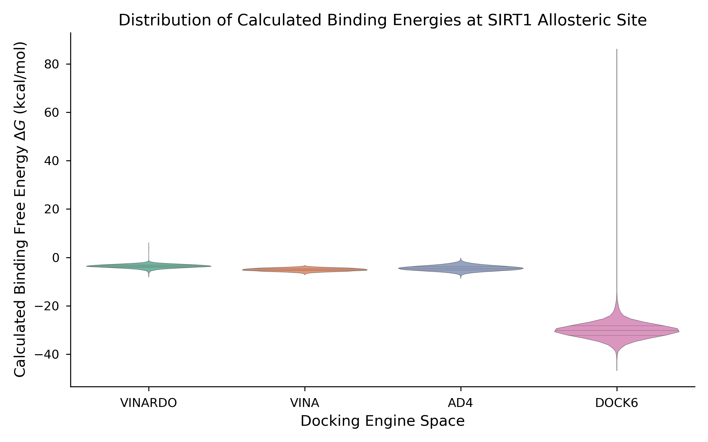
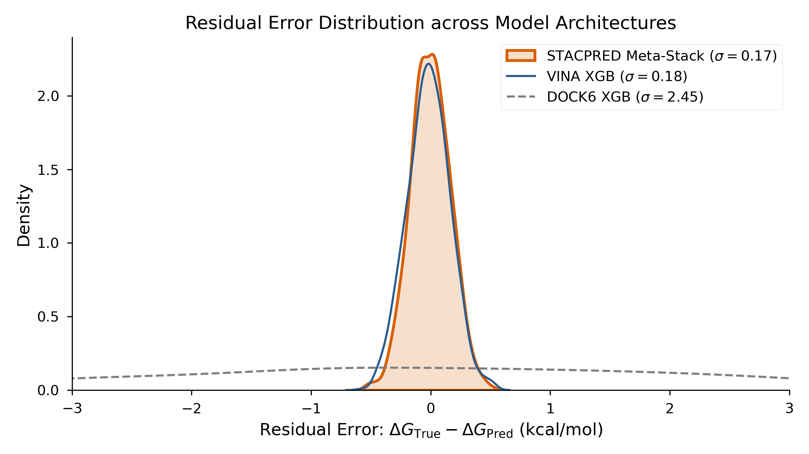
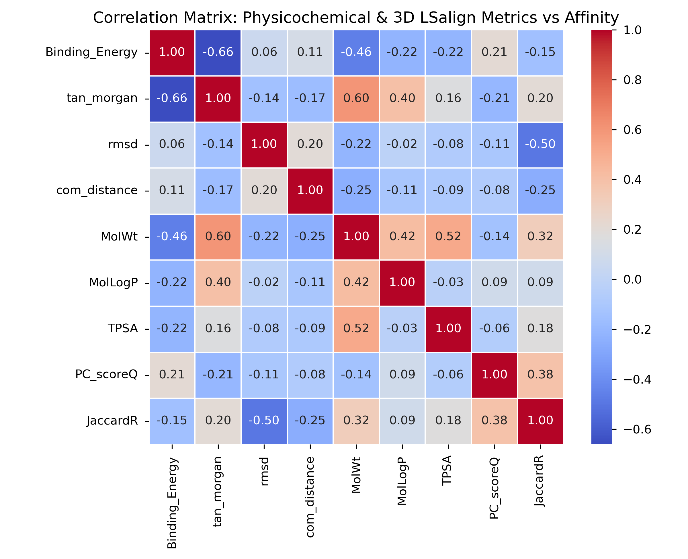

# STACPRED: Structure-Guided Machine Learning Framework for Predicting SIRT1 Allosteric Activator Binding Affinity

[](https://github.com/)
[](https://www.python.org/)
[](https://scikit-learn.org/)
[](LICENSE)

---

## 🔬 Overview

**STACPRED** is a production-grade, physics-informed machine learning and cheminformatics framework engineered for high-confidence binding free energy ($\Delta G$) prediction of small-molecule allosteric activators targeting human **Sirtuin-1 (SIRT1)**. 

Traditional molecular docking scoring functions frequently suffer from high false-positive rates and force-field biases. STACPRED overcomes these limitations through a **two-tier stacking meta-learner architecture** that fuses consensus outputs from four independent physics-based docking engines processed across heterogeneous machine learning paradigms (Extreme Gradient Boosting and Deep Multi-Layer Perceptrons).

---

## 📊 Comprehensive Model Performance & Benchmark Analysis

### 1. Overall Model Performance ($R^2$ Comparison)
STACPRED integrates an 8-model base ensemble fused via regularized linear regression (**RidgeCV**). As shown below, the meta-stack consensus model successfully surpasses all individual base estimators, achieving a peak test validation **$R^2 = 0.9154$**.



* **Tier 1 Base Performance:** Tree-based models (XGBoost) consistently outperform deep neural networks (MLP) across matching docking force fields, with Vina-XGB leading individual base performance ($R^2 = 0.9080$).
* **Tier 2 Consensus Gain:** The meta-stacking strategy captures complementary non-linear patterns across diverse scoring functions, reducing overall residual variance.

---

### 2. Parity Analysis: Base Model vs. Meta-Stack Consensus
The parity plots below contrast the prediction error distribution of the top single base model (**Vina XGB**) against the **STACPRED Meta-Stack Consensus**.



* **Reasoning:** The meta-stack consensus narrows the spread around the ideal diagonal line ($y = x$), minimizing extreme over- and under-estimations common in isolated docking engines.

---

### 3. Stacking Meta-Learner Weight Distribution ($\alpha = 2.0565$)
The RidgeCV meta-learner assigns explicit linear coefficients to each base model to optimize consensus prediction.



* **Core Driver:** **Vina XGB** dominates the positive feature weight ($1.1769$), reflecting its robust correlation with experimental binding affinities. 
* **Regularization Role:** Auxiliary estimators (such as Vinardo, AD4, and DOCK6 variants) receive balanced minor or negative corrective weights to suppress systematic force-field biases and orthogonal noise.

---

### 4. Docking Engine Binding Energy Behavior
The violin distributions highlight the distinct energy scales and variance profiles across the four underlying physics engines (**Vinardo, Vina, AD4, and DOCK6**).



* **Observation:** While Vina, Vinardo, and AD4 operate within a tightly bounded energy range ($\approx -5$ to $-10\text{ kcal/mol}$), UCSF DOCK6 exhibits wider energetic spreads and extreme outliers, emphasizing the necessity of machine learning outlier filtering and feature scaling prior to ensemble integration.

---

### 5. Residual Error Contraction & Variance Reduction
Kernel density estimation of residual errors ($\Delta G_{\text{True}} - \Delta G_{\text{Pred}}$) illustrates the superior precision of the ensemble framework.



* **Statistical Gain:** STACPRED compresses the residual standard deviation down to **$\sigma = 0.17\text{ kcal/mol}$** (outperforming Vina XGB at $\sigma = 0.18\text{ kcal/mol}$ and drastically suppressing the high variance seen in raw DOCK6 models at $\sigma = 2.45$).

---

### 6. Cheminformatics Feature Correlation Matrix
The multi-dimensional feature space incorporates over 2,085 structural descriptors, including ECFP Morgan fingerprints, physicochemical properties, and 3D **LSalign** structural alignment metrics.



* **Key Insights:** Moderate-to-strong correlations between topological fingerprints (`tan_morgan`), molecular weight (`MolWt`), and alignment metrics (`JaccardR`, `rms_d`) provide the multi-faceted feature matrix necessary for robust binding affinity inference.

---

## 📂 Repository Structure

```text
STACPRED/
├── .github/workflows/                 # CI/CD and automation workflows
├── bin/                               # Native compiled binaries (LSalign.exe)
├── config/                            # Conda environment configuration specifications (.yml)
├── data/                              # Data containers
│   ├── processed/                     # Lightweight sample processed feature CSVs (10-row truncated)
│   └── references/                    # Benchmark 3D reference templates (.mol2, .sdf)
├── docs/                              # Project documentation, flowcharts, and validation reports
├── figures/                           # High-resolution performance plots and model analysis figures
├── models/                            # Pre-trained base models (.pkl) and stacking meta-learner
├── protocols/                         # Reproducible docking workflows (AutoDock 4, DOCK 6, Vina, Vinardo)
├── src/                               # Modular Python source modules (curation, docking, features, inference)
├── web_app/                           # Full-stack Flask application (templates, static assets, app.py)
├── LICENSE
├── README.md
└── setup.py
```

---

## 🚀 Installation & Setup Guide

### Prerequisites

- Python 3.11 or higher
- Windows, Linux, or macOS
- Git installed

> Windows users: Enable Windows Long Paths if working with deeply nested directories.

### Step 1: Clone the Repository

```bash
git clone https://github.com/your-username/STACPRED.git
cd STACPRED
```

### Step 2: Create an Isolated Virtual Environment

```bash
python -m venv env
```

Windows:

```bash
env\Scripts\activate
```

Linux/macOS:

```bash
source env/bin/activate
```

### Step 3: Install Dependencies

```bash
python -m pip install --upgrade pip
pip install -e .

## 💻 Running the Web Application Console

Launch the Flask Server:

python web_app/app.py

ccess the Web Console: Open your browser and navigate to http://127.0.0.1:8000.

Execute Predictions:

Select an Alignment Reference Structure from the dropdown menu (e.g., 4tq_PDB_4ZZJ.mol2 or Resveratrol.mol2).

Drag and drop your target ligand .mol2 file into the upload zone.

Click Initiate Ensemble Prediction to view real-time molecular profiling, structural alignment validation, base model contributions, and the final stacked consensus score.

## 📜 Reproducible Docking Protocols

For researchers interested in replicating or inspecting the original computational workflow, step-by-step docking execution scripts, configuration files, grid parameter files (.gpf), and docking parameter files (.dpf) are documented inside the protocols/ directory.


## 📄 License

Distributed under the MIT License. See LICENSE for more information.