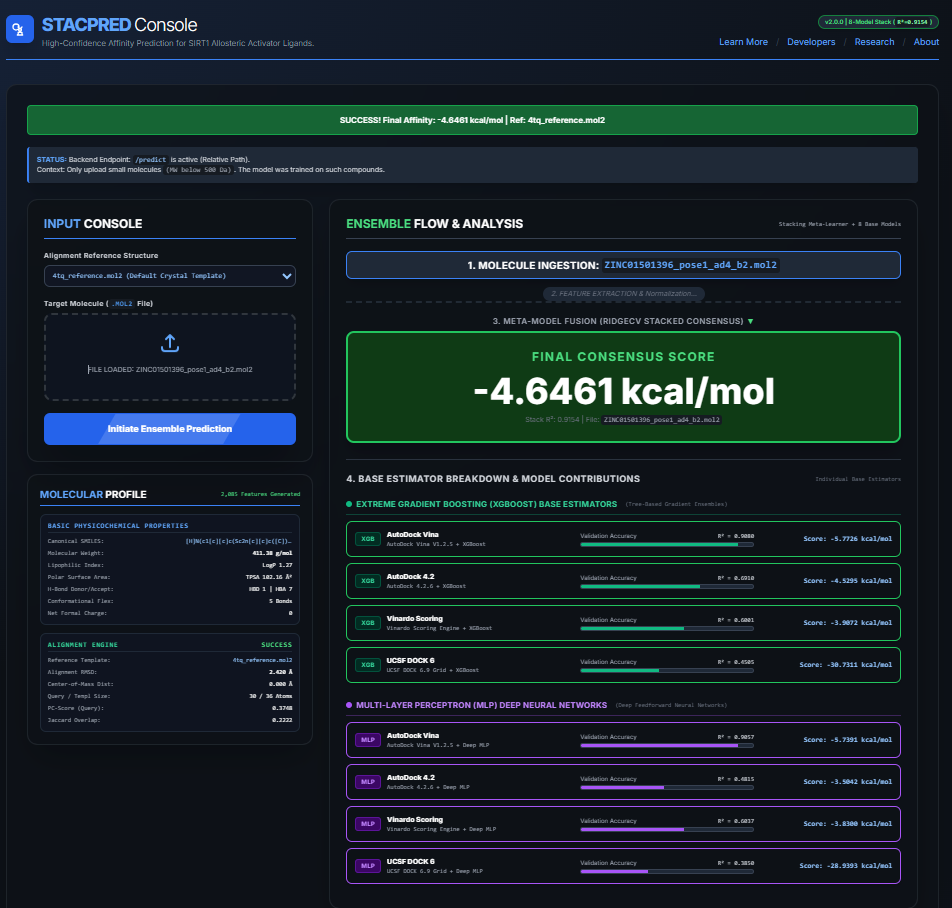

# STACPRED: Structure-Guided Machine Learning Framework for Predicting SIRT1 Allosteric Activator Binding Affinity

[](https://github.com/)
[](https://www.python.org/)
[](https://scikit-learn.org/)
[](LICENSE)

---

## 🔬 Overview

**STACPRED** is a production-grade, physics-informed machine learning and cheminformatics framework engineered for high-confidence binding free energy ($\Delta G$) prediction of small-molecule allosteric activators targeting human **Sirtuin-1 (SIRT1)**. 

Traditional molecular docking scoring functions frequently suffer from high false-positive rates and force-field biases. STACPRED overcomes these limitations through a **two-tier stacking meta-learner architecture** that fuses consensus outputs from four independent physics-based docking engines processed across heterogeneous machine learning paradigms (Extreme Gradient Boosting and Deep Multi-Layer Perceptrons).

---


## 🎯 Scientific Significance & Innovations


1. **Consensus Variance Reduction:** By integrating scoring outputs from **AutoDock Vina**, **AutoDock 4.2**, **Vinardo**, and **UCSF DOCK 6**, STACPRED minimizes systematic scoring errors inherent to individual force fields.

2. **High-Dimensional Feature Representation:** The framework computes **2,085 molecular descriptors** per query compound, encompassing 2D/3D physicochemical properties, ECFP Morgan topological fingerprints, MACCS structural keys, and quantitative 3D structural alignment metrics via **LSalign** (calculating RMSD, PC-scores, Jaccard overlap, and center-of-mass distances against benchmark reference templates).

3. **Translational Web Console:** Beyond standard research scripts, STACPRED includes an interactive, real-time **Flask web console** featuring live feature extraction diagnostics, alignment evaluation, model confidence weighting, and complete base-estimator contribution breakdowns.


---


## ⚙️ Model Architecture & Performance


STACPRED relies on an **8-model heterogeneous ensemble** integrated via a regularized linear regression meta-learner (**RidgeCV**):


* **Tier 1: Base Estimators (8 Models):**

  * **XGBoost Ensembles (4):** Vina-XGB ($R^2 = 0.9080$), AD4-XGB ($R^2 = 0.6910$), Vinardo-XGB ($R^2 = 0.6001$), DOCK6-XGB ($R^2 = 0.4505$).

  * **Deep Neural Networks (4):** Vina-MLP ($R^2 = 0.9057$), Vinardo-MLP ($R^2 = 0.6037$), AD4-MLP ($R^2 = 0.4815$), DOCK6-MLP ($R^2 = 0.3850$).

* **Tier 2: Meta-Learner:**

  * **RidgeCV Meta-Stacker:** Fuses base predictions to achieve a final cross-validated stacked performance of **$R^2 = 0.9154$**.


---

## 📂 Repository Structure

```text
STACPRED/
├── .github/workflows/                 # CI/CD and automation workflows
├── bin/                               # Native compiled binaries (LSalign.exe)
├── config/                            # Conda environment configuration specifications (.yml)
├── data/                              # Data containers
│   ├── processed/                     # Lightweight sample processed feature CSVs (10-row truncated)
│   └── references/                    # Benchmark 3D reference templates (.mol2, .sdf)
├── docs/                              # Project documentation, flowcharts, and validation reports
├── figures/                           # High-resolution performance plots and model analysis figures
├── models/                            # Pre-trained base models (.pkl) and stacking meta-learner
├── protocols/                         # Reproducible docking workflows (AutoDock 4, DOCK 6, Vina, Vinardo)
├── src/                               # Modular Python source modules (curation, docking, features, inference)
├── web_app/                           # Full-stack Flask application (templates, static assets, app.py)
├── LICENSE
├── README.md
└── setup.py
```

---

## 🚀 Installation & Setup Guide

### Prerequisites

- Python 3.11 or higher
- Windows, Linux, or macOS
- Git installed

> Windows users: Enable Windows Long Paths if working with deeply nested directories.

### Step 1: Clone the Repository

```bash
git clone https://github.com/your-username/STACPRED.git
cd STACPRED
```

### Step 2: Create an Isolated Virtual Environment

```bash
python -m venv env
```

Windows:

```bash
env\Scripts\activate
```

Linux/macOS:

```bash
source env/bin/activate
```

### Step 3: Install Dependencies

```bash
python -m pip install --upgrade pip
pip install -e .

## 💻 Running the Web Application Console

Launch the Flask Server:

python web_app/app.py

ccess the Web Console: Open your browser and navigate to http://127.0.0.1:8000.

Execute Predictions:

Select an Alignment Reference Structure from the dropdown menu (e.g., 4tq_PDB_4ZZJ.mol2 or Resveratrol.mol2).

Drag and drop your target ligand .mol2 file into the upload zone.

Click Initiate Ensemble Prediction to view real-time molecular profiling, structural alignment validation, base model contributions, and the final stacked consensus score.

## 📜 Reproducible Docking Protocols

For researchers interested in replicating or inspecting the original computational workflow, step-by-step docking execution scripts, configuration files, grid parameter files (.gpf), and docking parameter files (.dpf) are documented inside the protocols/ directory.


## 📄 License

Distributed under the MIT License. See LICENSE for more information.